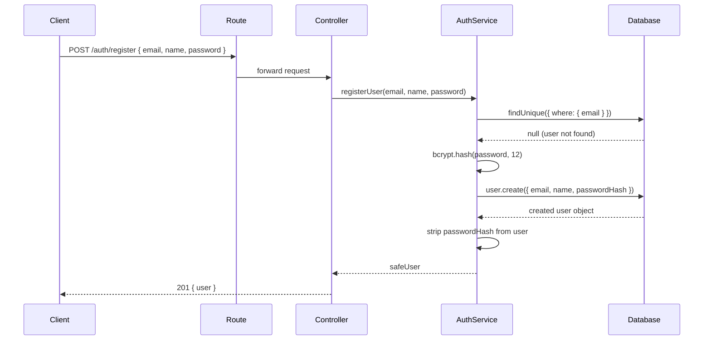
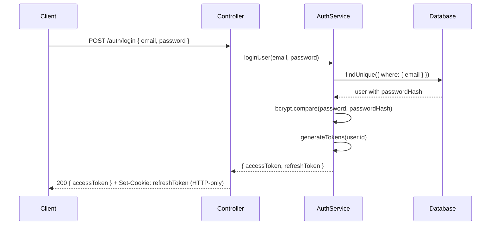
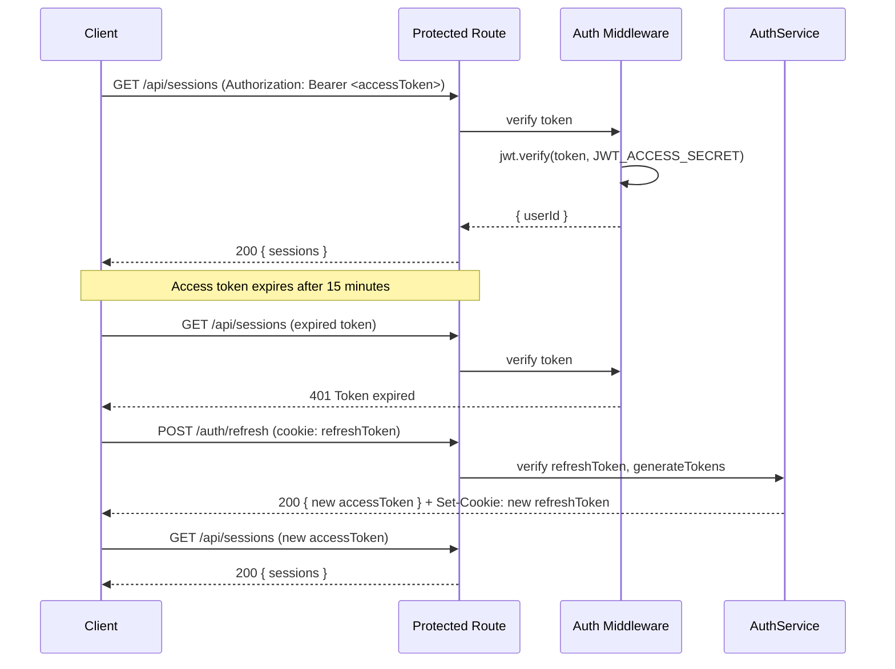

# Dot — Developer Journal & Technical Documentation

> A focused productivity app with Pomodoro session tracking and display lock for deep work.
> This document is a living record of every architectural decision, design choice, and implementation detail made during development.

---

## Table of Contents

1. [Project Overview](#1-project-overview)
2. [Tech Stack & Decisions](#2-tech-stack--decisions)
3. [Project Structure](#3-project-structure)
4. [Security Middleware](#4-security-middleware)
5. [Database Design](#5-database-design)
6. [Authentication System](#6-authentication-system)
7. [Sequence Diagrams](#7-sequence-diagrams)
8. [Environment Variables](#8-environment-variables)
9. [Development Log](#9-development-log)

---

## 1. Project Overview

**Dot** is a productivity application built for real users. It provides two core features:

- **Pomodoro Sessions** — structured work/break intervals to maintain focus
- **Display Lock** — locks the screen during focus sessions to eliminate distractions

The goal from day one is production-grade quality: secure by default, scalable by design, and maintainable over time.

---

## 2. Tech Stack & Decisions

| Layer            | Technology           | Why                                                                                                                         |
| ---------------- | -------------------- | --------------------------------------------------------------------------------------------------------------------------- |
| Frontend         | React (Vite)         | Fast dev server, modern tooling, component model                                                                            |
| Backend          | Express + TypeScript | Lightweight, flexible, type safety catches bugs at compile time                                                             |
| Database         | PostgreSQL (Neon)    | Relational, ACID-compliant, excellent Prisma support. Neon provides serverless Postgres — no infra to manage                |
| ORM              | Prisma               | Type-safe queries generated from schema. Migrations are version-controlled. Eliminates an entire class of runtime DB errors |
| Auth             | JWT (dual token)     | Stateless, scalable. Dual token pattern limits damage window if a token is stolen                                           |
| Password Hashing | bcrypt               | Industry standard. Intentionally slow — makes brute-force attacks expensive                                                 |

### Why TypeScript over JavaScript

TypeScript's `strict` mode was enabled from day one. This means:

- Every function parameter must be typed
- `null` and `undefined` are handled explicitly
- No silent `any` types

The cost is slightly more verbose code. The benefit is catching bugs at compile time instead of production runtime.

### Why Prisma over raw SQL or other ORMs

Prisma generates a fully typed client from the schema. Querying a column that doesn't exist is a compile error, not a runtime crash. Migration files are committed to git — the database schema has version history just like the code.

---

## 3. Project Structure

```
dot/
├── client/                   # React frontend (Vite)
└── server/
    ├── prisma/
    │   ├── schema.prisma     # Database schema — source of truth
    │   ├── migrations/       # Version-controlled migration history
    │   └── prisma.config.ts  # Prisma 7 config (connection URL, paths)
    ├── src/
    │   ├── controllers/      # HTTP layer — reads req, writes res
    │   ├── middleware/       # Auth guards, rate limiting
    │   ├── routes/           # URL definitions — maps paths to controllers
    │   ├── services/         # Business logic — no HTTP, fully testable
    │   ├── types/            # Shared TypeScript interfaces
    │   ├── utils/            # Shared helpers (Prisma singleton, etc.)
    │   ├── app.ts            # Express app setup and middleware wiring
    │   └── index.ts          # Server entry point — starts the listener
    ├── .env                  # Secrets — never committed
    ├── .env.example          # Safe template — committed to git
    └── tsconfig.json
```

### The Request Lifecycle

Every HTTP request flows through exactly these layers in order:

```
Incoming Request
    ↓
Rate Limiter (blocks abuse)
    ↓
CORS (validates request origin)
    ↓
Helmet (sets security headers)
    ↓
express.json() (parses request body)
    ↓
Route (matches URL to handler)
    ↓
Controller (reads req, calls service, writes res)
    ↓
Service (business logic, DB queries)
    ↓
Response sent
```

This is a strict one-way dependency chain. Services never call controllers. Controllers never contain business logic. This separation makes each layer independently testable.

---

## 4. Security Middleware

Three security packages are applied globally before any route is hit.

### Helmet

```ts
app.use(helmet());
```

Sets 14 HTTP security headers automatically. Key ones:

- `X-Frame-Options: DENY` — prevents clickjacking (embedding the app in an iframe on a malicious site)
- `X-Content-Type-Options: nosniff` — prevents MIME type sniffing attacks
- `Strict-Transport-Security` — forces HTTPS on supported browsers

### CORS

```ts
app.use(
  cors({
    origin: process.env.CORS_ORIGIN,
    credentials: true,
  }),
);
```

`credentials: true` is required to allow cookies (used for the refresh token) to be sent cross-origin. `origin` is explicitly set to the frontend URL — wildcard `*` is never used in production.

### Rate Limiting

```ts
// 100 requests per 15 minutes per IP (global)
```

Prevents brute-force attacks and API abuse. Auth endpoints will have a tighter limit (e.g. 5 requests per 15 minutes) to specifically protect against password guessing.

---

## 5. Database Design

### Schema

Three models with one enum. Designed in Prisma and migrated to Neon PostgreSQL.

```prisma
enum SessionStatus {
  COMPLETED
  INTERRUPTED
}

model User {
  id           String            @id @default(cuid())
  email        String            @unique
  name         String
  passwordHash String
  createdAt    DateTime          @default(now())
  updatedAt    DateTime          @updatedAt
  sessions     PomodoroSession[]
  focusLocks   FocusLock[]
}

model PomodoroSession {
  id          String        @id @default(cuid())
  userId      String
  user        User          @relation(fields: [userId], references: [id])
  duration    Int
  startedAt   DateTime
  completedAt DateTime?
  status      SessionStatus
  createdAt   DateTime      @default(now())
}

model FocusLock {
  id        String    @id @default(cuid())
  userId    String
  user      User      @relation(fields: [userId], references: [id])
  startedAt DateTime  @default(now())
  endedAt   DateTime?
  isActive  Boolean   @default(true)
  createdAt DateTime  @default(now())
}
```

### Key Design Decisions

**`cuid()` over `autoincrement()`**
Sequential integer IDs (`1, 2, 3`) allow users to enumerate records (`/sessions/1`, `/sessions/2`). `cuid()` generates collision-resistant IDs that are impossible to guess.

**`passwordHash` not `password`**
The field name documents its intent. Anyone reading the schema instantly knows a hash is stored, not a plaintext password.

**`completedAt DateTime?` (nullable)**
A null value means the session was interrupted. This avoids a separate boolean flag — the presence or absence of a timestamp carries the meaning.

**`FocusLock` is separate from `PomodoroSession`**
A user might lock their display without starting a pomodoro. Keeping them separate lets each feature be queried and reported on independently.

**Migration history**

```
prisma/migrations/
└── 20260526030131_init/
    └── migration.sql
```

Migration files are committed to git. They are the version history of the database schema — the same way commits are the version history of the code. Running `prisma migrate deploy` on a fresh database replays every migration in order and produces an exact replica of the current schema.

---

## 6. Authentication System

### Why Dual Tokens

A single long-lived JWT is dangerous — if stolen, the attacker has access for the entire lifetime of the token (days or weeks) with no way to revoke it.

The dual token pattern limits the damage window:

| Token         | Lifespan   | Storage                       | Purpose                                |
| ------------- | ---------- | ----------------------------- | -------------------------------------- |
| Access Token  | 15 minutes | Memory / Authorization header | Sent with every API request            |
| Refresh Token | 7 days     | HTTP-only cookie              | Only used to obtain a new access token |

**HTTP-only cookies cannot be read by JavaScript.** Even if an attacker successfully runs malicious JavaScript on the page (XSS), they cannot steal the refresh token. This eliminates the most common JWT theft vector.

### Password Hashing

```ts
bcrypt.hash(password, 12); // 12 = salt rounds
```

bcrypt is intentionally slow. 12 salt rounds takes ~250ms per hash — imperceptible to a real user, but multiplied across millions of brute-force attempts, it makes attacks computationally expensive.

### Information Leak Prevention

```ts
// Wrong email:
throw new Error("Invalid credentials");

// Wrong password:
throw new Error("Invalid credentials");
```

Both failure cases return the identical error message. If wrong-email returned "User not found" and wrong-password returned "Incorrect password", an attacker could enumerate valid email addresses by reading the error response.

### JWT Secret Generation

Secrets are generated using OS-level randomness:

```bash
node -e "console.log(require('crypto').randomBytes(64).toString('hex'))"
```

This produces 64 bytes (`2^512` possible values) — no dictionary or brute-force attack is feasible. Two separate secrets are used — one for access tokens, one for refresh tokens — so compromise of one does not compromise the other.

---

## 7. Sequence Diagrams

### User Registration



### User Login



### Authenticated Request + Token Refresh



---

## 8. Environment Variables

All secrets and environment-specific config live in `server/.env`. This file is never committed to git. `server/.env.example` documents the required keys.

| Variable             | Purpose                                                              |
| -------------------- | -------------------------------------------------------------------- |
| `PORT`               | Port the Express server listens on                                   |
| `CORS_ORIGIN`        | Allowed frontend origin (e.g. `http://localhost:5173`)               |
| `DATABASE_URL`       | Neon PostgreSQL connection string (requires `?sslmode=require`)      |
| `JWT_ACCESS_SECRET`  | Signs access tokens — 64 random bytes                                |
| `JWT_REFRESH_SECRET` | Signs refresh tokens — 64 random bytes, different from access secret |

---

## 9. Development Log

### Session 1

- Converted server from plain JavaScript to TypeScript
- Configured `tsconfig.json` with `strict: true` and `NodeNext` module resolution
- Set up `dev`, `build`, and `start` scripts
- Learned: all relative imports require `.js` extension under `NodeNext` resolution

### Session 2

- Built Express app structure (`app.ts` / `index.ts` separation)
- Added Helmet, CORS, and rate limiting middleware
- Set up `.env` / `.env.example` pattern
- Learned: `dotenv/config` must be the first import in `index.ts`

### Session 3

- Designed and wrote Prisma schema (User, PomodoroSession, FocusLock)
- Navigated Prisma 7 breaking change: `url` moved from `schema.prisma` to `prisma.config.ts`
- Ran initial migration against Neon — all three tables created
- Learned: `prisma migrate` changes the database, `prisma generate` generates the TypeScript client — two separate steps

### Session 4

- Built `authService.ts` with `registerUser`, `loginUser`, `generateTokens`
- Implemented dual token auth (access 15min + refresh 7d)
- Learned: services throw errors, controllers handle HTTP responses — layers never mix
- Learned: same error message for wrong email and wrong password prevents user enumeration

---

_Last updated: 5/27/26_
