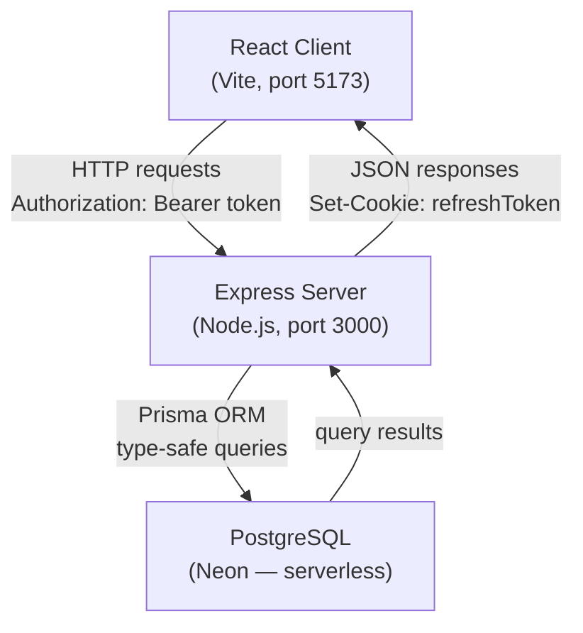
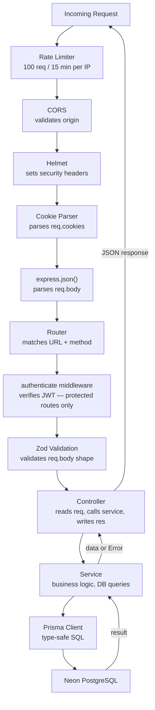
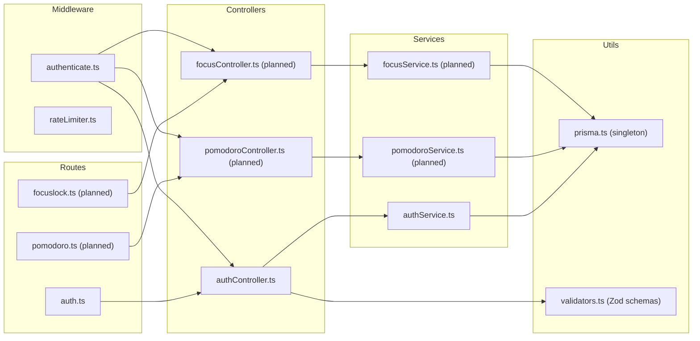
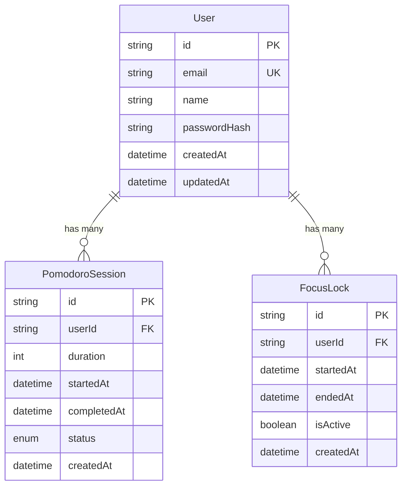
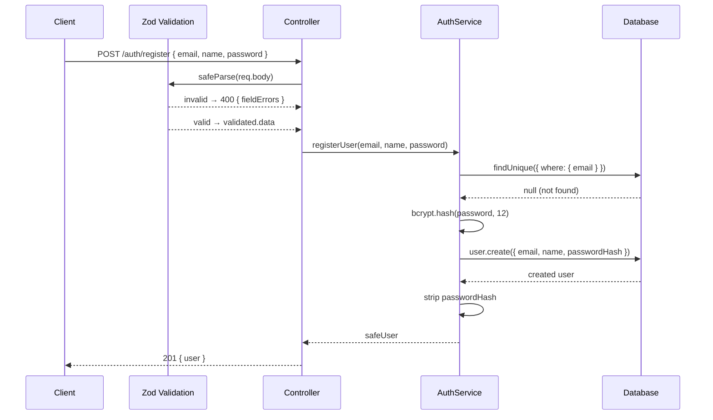
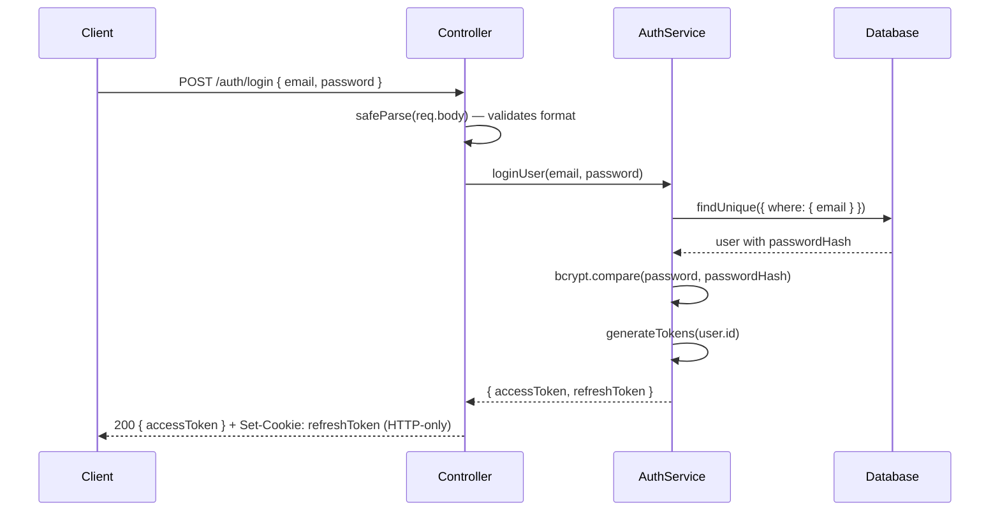
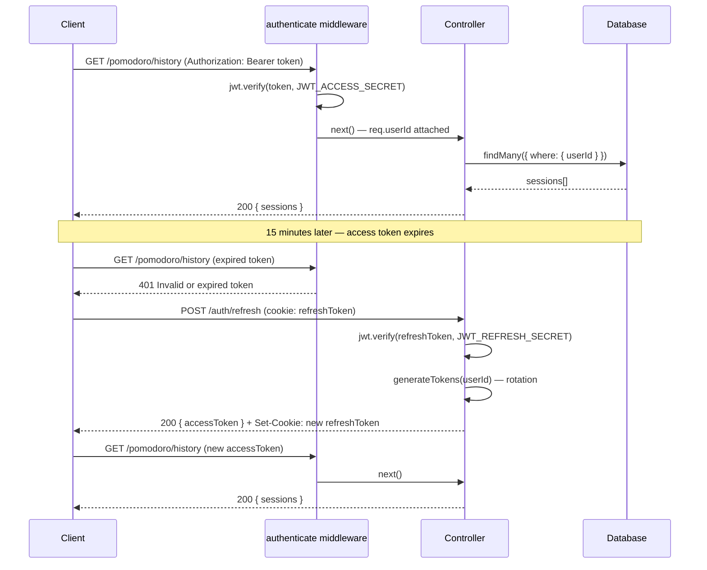

# Dot — Developer Journal & Technical Documentation

> A focused productivity app with Pomodoro session tracking and display lock for deep work.
> This document is a living record of every architectural decision, design choice, and implementation detail made during development.

---

## Table of Contents

1. [Project Overview](#1-project-overview)
2. [System Architecture](#2-system-architecture)
3. [Tech Stack & Decisions](#3-tech-stack--decisions)
4. [Project Structure](#4-project-structure)
5. [Security Middleware](#5-security-middleware)
6. [Database Design](#6-database-design)
7. [Authentication System](#7-authentication-system)
8. [Input Validation](#8-input-validation)
9. [Sequence Diagrams](#9-sequence-diagrams)
10. [Environment Variables](#10-environment-variables)
11. [Development Log](#11-development-log)

---

## 1. Project Overview

**Dot** is a productivity application built for real users. It provides two core features:

- **Pomodoro Sessions** — structured work/break intervals to maintain focus
- **Display Lock** — locks the screen during focus sessions to eliminate distractions

The goal from day one is production-grade quality: secure by default, scalable by design, and maintainable over time.

---

## 2. System Architecture

### High-Level Architecture



### Server Layer Architecture

Every request passes through a strict set of layers in order. No layer can skip another.



### Component Map



---

## 3. Tech Stack & Decisions

| Layer | Technology | Why |
|---|---|---|
| Frontend | React (Vite) | Fast dev server, modern tooling, component model |
| Backend | Express + TypeScript | Lightweight, flexible, type safety catches bugs at compile time |
| Database | PostgreSQL (Neon) | Relational, ACID-compliant, excellent Prisma support. Neon provides serverless Postgres — no infra to manage |
| ORM | Prisma | Type-safe queries generated from schema. Migrations are version-controlled. Eliminates an entire class of runtime DB errors |
| Auth | JWT (dual token) | Stateless, scalable. Dual token pattern limits damage window if a token is stolen |
| Password Hashing | bcrypt | Industry standard. Intentionally slow — makes brute-force attacks expensive |
| Validation | Zod | Runtime schema validation with full TypeScript inference. Errors are per-field and human-readable |

### Why TypeScript over JavaScript

TypeScript's `strict` mode was enabled from day one. This means:
- Every function parameter must be typed
- `null` and `undefined` are handled explicitly
- No silent `any` types

The cost is slightly more verbose code. The benefit is catching bugs at compile time instead of production runtime.

### Why Prisma over raw SQL or other ORMs

Prisma generates a fully typed client from the schema. Querying a column that doesn't exist is a compile error, not a runtime crash. Migration files are committed to git — the database schema has version history just like the code.

---

## 4. Project Structure

```
dot/
├── client/                        # React frontend (Vite) — not yet built
└── server/
    ├── prisma/
    │   ├── schema.prisma          # Database schema — single source of truth
    │   ├── migrations/            # Version-controlled migration history
    │   └── prisma.config.ts       # Prisma 7 config — connection URL lives here
    ├── src/
    │   ├── controllers/
    │   │   └── authController.ts  # register, login, refresh, logout
    │   ├── middleware/
    │   │   ├── authenticate.ts    # JWT verification for protected routes
    │   │   └── rateLimiter.ts     # 100 req / 15 min global limit
    │   ├── routes/
    │   │   └── auth.ts            # POST /auth/* route definitions
    │   ├── services/
    │   │   └── authService.ts     # registerUser, loginUser, generateTokens
    │   ├── types/
    │   │   └── express.d.ts       # extends Request with userId?: string
    │   ├── utils/
    │   │   ├── prisma.ts          # PrismaClient singleton
    │   │   └── validators.ts      # Zod schemas — registerSchema, loginSchema
    │   ├── app.ts                 # Express app — middleware wiring + routes
    │   └── index.ts               # Server entry point — starts listener
    ├── .env                       # Secrets — never committed
    ├── .env.example               # Safe template — committed to git
    ├── package.json
    └── tsconfig.json
```

---

## 5. Security Middleware

All middleware is registered in `app.ts` before any route is hit.

### Helmet
Sets 14 HTTP security headers automatically:
- `X-Frame-Options: DENY` — prevents clickjacking
- `X-Content-Type-Options: nosniff` — prevents MIME sniffing
- `Strict-Transport-Security` — forces HTTPS on supporting browsers

### CORS
```ts
app.use(cors({ origin: process.env.CORS_ORIGIN, credentials: true }))
```
`credentials: true` is required so browsers send HTTP-only cookies cross-origin (needed for the refresh token). Wildcard `*` is never used — only the frontend URL is whitelisted.

### Rate Limiting
100 requests per 15 minutes per IP globally. Auth endpoints will receive a tighter limit in a future session.

### Cookie Parser
Required for `req.cookies` to be populated. Without it, reading the refresh token in the `/refresh` endpoint would always return `undefined`.

---

## 6. Database Design

### Schema

```prisma
enum SessionStatus {
  COMPLETED
  INTERRUPTED
}

model User {
  id           String            @id @default(cuid())
  email        String            @unique
  name         String
  passwordHash String
  createdAt    DateTime          @default(now())
  updatedAt    DateTime          @updatedAt
  sessions     PomodoroSession[]
  focusLocks   FocusLock[]
}

model PomodoroSession {
  id          String        @id @default(cuid())
  userId      String
  user        User          @relation(fields: [userId], references: [id])
  duration    Int
  startedAt   DateTime
  completedAt DateTime?
  status      SessionStatus
  createdAt   DateTime      @default(now())
}

model FocusLock {
  id        String    @id @default(cuid())
  userId    String
  user      User      @relation(fields: [userId], references: [id])
  startedAt DateTime  @default(now())
  endedAt   DateTime?
  isActive  Boolean   @default(true)
  createdAt DateTime  @default(now())
}
```

### Entity Relationship Diagram



### Key Design Decisions

**`cuid()` over `autoincrement()`** — Sequential IDs allow enumeration attacks (`/sessions/1`, `/sessions/2`). cuid generates collision-resistant IDs that are impossible to predict.

**`passwordHash` not `password`** — Field name makes intent explicit. Anyone reading the schema knows a hash is stored.

**`completedAt DateTime?` nullable** — Null means interrupted. No need for a separate boolean flag — the timestamp's presence carries the meaning.

**`FocusLock` separate from `PomodoroSession`** — A user can lock their display without starting a pomodoro. Separate tables allow independent querying and reporting.

---

## 7. Authentication System

### Dual Token Design

| Token | Lifespan | Storage | Purpose |
|---|---|---|---|
| Access Token | 15 minutes | JS memory / Authorization header | Sent with every API request |
| Refresh Token | 7 days | HTTP-only cookie | Only used to obtain a new access token |

**HTTP-only cookies** cannot be read by JavaScript. XSS attacks that run malicious JS on the page cannot steal the refresh token.

**Token rotation** — every call to `/auth/refresh` issues a completely new refresh token, replacing the old one. A stolen refresh token becomes useless the moment the legitimate user refreshes.

### Auth Middleware

`src/middleware/authenticate.ts` protects all non-auth routes:

```
1. Read Authorization header
2. If missing → 401
3. Split "Bearer <token>" → extract token
4. jwt.verify(token, JWT_ACCESS_SECRET) → throws if invalid/expired
5. Cast payload as { userId: string }
6. Attach userId to req.userId
7. Call next() → controller runs
```

`src/types/express.d.ts` extends Express's built-in `Request` interface to add `userId?: string`, making `req.userId` type-safe across the entire project.

### Password Security
- `bcrypt.hash(password, 12)` — 12 salt rounds, ~250ms per hash
- Same error message for wrong email and wrong password — prevents user enumeration

### API Endpoints

| Method | Endpoint | Auth Required | Description |
|---|---|---|---|
| POST | `/auth/register` | No | Create account |
| POST | `/auth/login` | No | Get tokens |
| POST | `/auth/refresh` | No (uses cookie) | Rotate tokens |
| POST | `/auth/logout` | No | Clear cookie |

---

## 8. Input Validation

Zod schemas in `src/utils/validators.ts` validate `req.body` at the top of every controller, before the service is called.

```ts
// Register
z.object({
  email:    z.string().email(),
  name:     z.string().min(1).max(100),
  password: z.string().min(8).max(100)
})

// Login
z.object({
  email:    z.string().email(),
  password: z.string().min(8).max(100)
})
```

`safeParse` is used instead of `parse` — it returns `{ success, data, error }` without throwing, fitting naturally into the existing try/catch structure.

**Why `max(100)` on password?** bcrypt internally limits input to 72 bytes. Without a max length cap, a malicious actor could send a 10MB string to make the server hang while bcrypt processes it — a cheap DoS vector. `max(100)` eliminates this.

---

## 9. Sequence Diagrams

### User Registration



### User Login



### Authenticated Request + Token Refresh



---

## 10. Environment Variables

| Variable | Purpose |
|---|---|
| `PORT` | Port the Express server listens on |
| `CORS_ORIGIN` | Allowed frontend origin |
| `DATABASE_URL` | Neon PostgreSQL connection string (requires `?sslmode=require`) |
| `JWT_ACCESS_SECRET` | Signs access tokens — 64 random bytes |
| `JWT_REFRESH_SECRET` | Signs refresh tokens — 64 random bytes, different from access secret |

---

## 11. Development Log

### Session 1
- Converted server from plain JavaScript to TypeScript
- Configured `tsconfig.json` with `strict: true` and `NodeNext` module resolution
- Set up `dev`, `build`, and `start` scripts
- **Learned:** all relative imports require `.js` extension under `NodeNext` resolution

### Session 2
- Built Express app structure (`app.ts` / `index.ts` separation)
- Added Helmet, CORS, rate limiting, cookie-parser middleware
- Set up `.env` / `.env.example` pattern
- **Learned:** `dotenv/config` must be the first import in `index.ts`

### Session 3
- Designed Prisma schema (User, PomodoroSession, FocusLock)
- Navigated Prisma 7 breaking change — `url` moved from `schema.prisma` to `prisma.config.ts`
- Ran initial migration against Neon — all three tables created
- **Learned:** `prisma migrate` changes the database, `prisma generate` generates the TypeScript client — two separate commands

### Session 4
- Built `authService.ts` — `registerUser`, `loginUser`, `generateTokens`
- Implemented dual token pattern (access 15min + refresh 7d)
- **Learned:** services throw errors, controllers handle HTTP — layers never mix
- **Learned:** same error message for wrong email and wrong password prevents user enumeration

### Session 5
- Built `authController.ts` — register, login, refresh, logout
- Refresh token set as HTTP-only cookie, access token in response body
- Token rotation implemented in refresh endpoint
- Added `cookie-parser` middleware — required for `req.cookies` to work
- Built `auth.ts` routes — four endpoints wired to controllers
- **Learned:** accidentally ran `npm install` from project root instead of `server/` — always check `pwd` before installing

### Session 6
- Built `authenticate.ts` middleware — reads Authorization header, verifies JWT, attaches `req.userId`
- Extended Express `Request` type via `src/types/express.d.ts` — makes `req.userId` type-safe
- Added Zod input validation — `registerSchema` and `loginSchema` in `src/utils/validators.ts`
- Validation runs before service calls — bad data never reaches the database
- **Learned:** `safeParse` returns `{ success, data, error }` — use `validated.data` not `validated` when passing to service. Validate input format with Zod, validate business rules (duplicate email) in the service — these are different concerns

---

*Last updated: Session 6*
